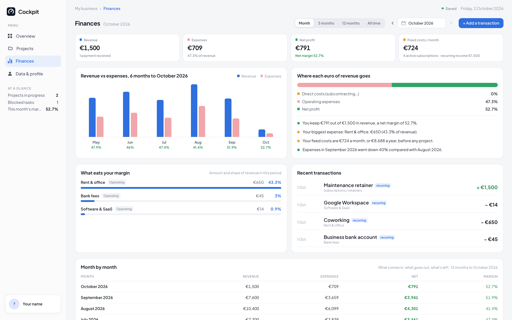
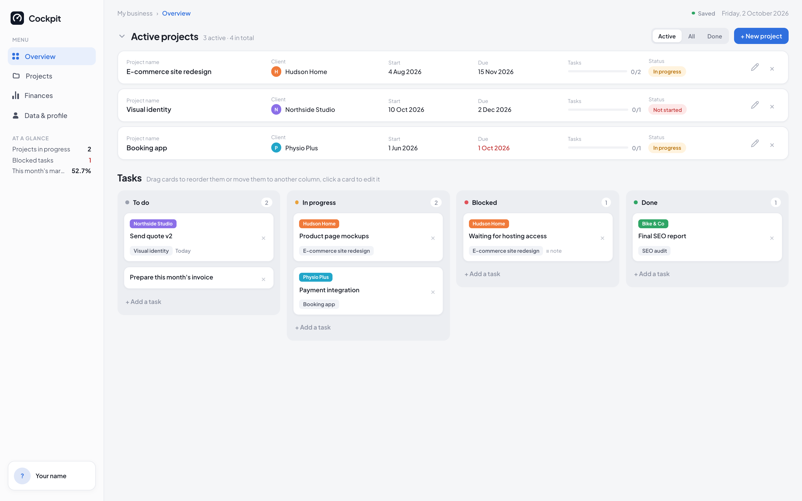

# Cockpit

Your business cockpit for freelancers and small studios: projects, a daily task board and your finances, in one fast and clean web app. It runs on your own free accounts, so your data stays yours.



- **Overview**: your active projects and a task board in 4 columns (To do, In progress, Blocked, Done). Drag cards to move or reorder them. Done tasks disappear from the board after a week (they stay saved).
- **Projects**: one page per project with a brief (context, goal, deliverables, out of scope) and a dated journal (calls, decisions, notes).
- **Finances**: revenue, direct costs, overheads and margin for one month, 3 months, 12 months or all time. Subscriptions, retainers and contractors are entered once and counted every month automatically.
- **Data & profile**: your name, photo and currency, your clients and their colours, transactions, recurring items, and a backup file you can download.



**No coding needed to install it.** You follow 6 steps, mostly copy and paste, and about 15 minutes later you have your own Cockpit online at an address like `https://your-name-cockpit.vercel.app`, that only you can open.

---

## What you need

- A computer and about 15 minutes.
- An email address you can open right now (the login link is sent there).
- Three free accounts, created in Step 1: **GitHub** (stores your copy of the code), **Supabase** (your database and login), **Vercel** (puts the site online). The free plans are enough; you will not be asked for a credit card for this.

Tip: open this page in one browser tab and do each step in another tab.

---

## Step 1. Create your three accounts

1. **GitHub**: go to [github.com/signup](https://github.com/signup) and create an account (skip this if you already have one).
2. **Supabase**: go to [supabase.com](https://supabase.com), click **Start your project**, and choose **Continue with GitHub**.
   Important: the email of this Supabase account is the one you will use to log in to Cockpit (see Troubleshooting).
3. **Vercel**: go to [vercel.com/signup](https://vercel.com/signup), choose the free **Hobby** plan, and choose **Continue with GitHub**.

---

## Step 2. Create your database (Supabase)

### 2.1 Create a project

1. In Supabase, click **New project**.
2. Fill in:
   - **Project name**: `cockpit` (or anything you like).
   - **Database password**: click **Generate a password**, then copy it somewhere safe (a password manager). You will not need it for the steps below.
   - **Region**: the one closest to you.
   - Leave every other option as it is (the Data API must stay enabled).
3. Click **Create new project** and wait 1 to 2 minutes until the dashboard is ready.

### 2.2 Create the tables (one copy and paste)

1. Open the file [`supabase/setup.sql`](https://github.com/CobraAl/business-cockpit/blob/main/supabase/setup.sql) in a new tab.
2. Click the **Copy raw file** button (the two-squares icon at the top right of the file). The whole file is now copied.
3. Back in Supabase, click **SQL Editor** in the left sidebar, then **+** / **New query** to open an empty editor.
4. Paste (Ctrl+V on Windows, Cmd+V on Mac), then click **Run** at the bottom right.
5. If Supabase shows a warning about a "destructive operation", click **Run this query**: it is expected and safe on a new project (the script replaces its own security rules once).
6. You should see **Success. No rows returned**. Your database is ready: 8 tables, each one locked so that every user only ever sees their own rows.

Run it only once. If you see `already exists`, it was already done: nothing to do, go on.

### 2.3 Copy your two keys

You need two values. Keep them in a note for Step 3.

1. Click the **Connect** button at the top of your Supabase project.
2. Copy:
   - the **Project URL**, which looks like `https://abcdefghijkl.supabase.co`;
   - the **Publishable key**, which starts with `sb_publishable_`.

If you don't see them there: the URL is under **Project Settings → Data API**, and the key under **Project Settings → API Keys**. (If you only find an older **anon** key, starting with `eyJ`, it works too.)

Never use the **secret** or **service_role** key here: it bypasses every security rule.

---

## Step 3. Put your Cockpit online (Vercel)

1. Click this button:

   [](https://vercel.com/new/clone?repository-url=https%3A%2F%2Fgithub.com%2FCobraAl%2Fbusiness-cockpit&project-name=cockpit&repository-name=cockpit&env=VITE_SUPABASE_URL,VITE_SUPABASE_PUBLISHABLE_KEY&envDescription=Your%20Supabase%20Project%20URL%20and%20Publishable%20key%20(Step%202.3%20of%20the%20README)&envLink=https%3A%2F%2Fgithub.com%2FCobraAl/business-cockpit%23readme)

2. Vercel asks where to create your copy of the code: pick your GitHub account. Keep the repository **private** if Vercel offers the choice. Then click **Create**.
3. Vercel asks for two **Environment Variables**. Paste your two values from Step 2.3:
   - `VITE_SUPABASE_URL` → your **Project URL**
   - `VITE_SUPABASE_PUBLISHABLE_KEY` → your **Publishable key**

   Check there is no space before or after each value.
4. Click **Deploy** and wait about a minute, until you see the congratulations screen.
5. Click **Continue to Dashboard**. Your site address is shown under **Domains**, for example `https://cockpit-abc123.vercel.app`. Copy it.

---

## Step 4. Tell Supabase your site address

Without this, the login link would send you to the wrong place.

1. In Supabase, go to **Authentication → URL Configuration**.
2. **Site URL**: paste your Vercel address (for example `https://cockpit-abc123.vercel.app`), then click **Save**.
3. **Redirect URLs**: click **Add URL**, paste the same address, then save.

---

## Step 5. Log in

1. Open your Vercel address. You see the **Sign in** page.
2. Type the email address of your Supabase account and click **Send me the link**.
3. Open the email from Supabase (subject "Confirm Your Signup" the first time, "Your Magic Link" afterwards) and click the link.
4. You are in Cockpit. Bookmark the page: next time you will already be logged in.

---

## Step 6. Lock the door

Your data is already private: nobody else can read it. This last step stops strangers from creating their own empty accounts on your Supabase project.

1. In Supabase, go to **Authentication → Sign In / Providers**.
2. Turn off **Allow new users to sign up**, then save.

Done. 🎉

---

## First steps in Cockpit

- **Data & profile → Profile**: your name, photo and currency.
- **Data & profile → Clients**: add your clients and pick a colour for each. Tasks and projects take that colour.
- **Overview**: add tasks with **+ Add a task**, drag them between columns. Add a project with **+ New project** (on the Projects page, or in **Active projects** on the Overview).
- **Finances**: add revenue and costs in **Data & profile** (one-off transactions, or subscriptions and recurring items once), then read the figures here.
- Want to look around first? **Data & profile → Backup → Load demo data** fills the app with an example. It **replaces** what you entered, so do it before adding your own data, then **Clear everything** when you are done exploring.
- **Data & profile → Backup → Export (.json)** downloads a copy of all your data. Do it from time to time.

---

## Troubleshooting

**The login email doesn't arrive.**
Check your spam folder. Until you plug in an email provider, Supabase only sends login emails to the email address of your Supabase account, and at most 2 emails per hour. So use that exact address, and if you asked for several links, wait an hour and try again. To log in with another address, set up an email provider in **Authentication → Emails → SMTP Settings** (for example [Resend](https://resend.com), which has a free plan).

**The link in the email opens `localhost` or a page that doesn't load.**
Step 4 is missing or has a typo. Fix it, then ask for a new link (the old one is used up).

**The link says it is invalid or has expired.**
Links work once and for a limited time. Ask for a new one and click it within a few minutes.

**There is no Sign in page, and what I enter disappears when I open the site on another device.**
The two Vercel variables are missing or misspelled, so the app is saving in your browser only. In Vercel, open your project → **Settings → Environment Variables**, fix the names and values (Step 3), then go to **Deployments**, click **⋯** on the latest one and choose **Redeploy**. The variables are only read when the site is built, so the redeploy is needed.

**"Couldn't load your data" after logging in, or "The database rejected your last change".**
The tables are missing: Step 2.2 was not run, or was run on another Supabase project than the one whose keys you used. Run it on the right project and reload the page.

**My Supabase project is paused.**
Free Supabase projects are paused after a week without any activity. Open the project in Supabase and click **Restore project**; your data is kept.

---

## Make it yours

Your copy of the code is in your GitHub account, and every change you push to it goes online automatically (Vercel rebuilds the site in about a minute).

The easiest way to change things without knowing how to code: open your copy with an AI coding assistant (for example Claude Code or Cursor) and describe what you want, like "make the main colour green" or "add a Training category to the costs".

Where things live, if you want to look yourself:

| What | Where |
| --- | --- |
| App name | the `Cockpit` text in `index.html`, `src/App.tsx` and `src/pages/LoginPage.tsx` |
| Logo | `public/logo.svg` and `public/favicon.svg`. If your logo is not the same shape, adjust the ratio in `BrandMark` (`src/components/ui.tsx`) |
| Colours, spacing | CSS variables at the top of `src/index.css`. Overall size: the `html { font-size: clamp(...) }` rule in the same file |
| Finance categories | `CATEGORIES` in `src/lib/constants.ts` |
| Names shown for statuses, task columns, journal entry types | `src/lib/constants.ts` (labels only) |
| Currencies offered, date and number format | `CURRENCIES` and `LOCALE` in `src/lib/constants.ts` |

Renaming a label is safe. Adding or removing a project status, task column or journal entry type also needs `src/types.ts` and a database change (a new file in `supabase/migrations/`), because the database only accepts the known values.

---

## For developers

Requirements: Node.js 22.12 or later.

```bash
npm install
npm run dev        # http://localhost:5173
npm test           # unit tests (task ordering and archiving)
npm run build
```

- Without a `.env.local` file the app runs on `localStorage` only, with no login: handy to try things.
- With your database: copy `.env.example` to `.env.local` and fill in the two values (never commit it). Add `http://localhost:5173` to the Redirect URLs in Supabase (Step 4).
- Database changes: add a migration in `supabase/migrations/`, then `supabase link --project-ref <ref>` and `supabase db push` with the [Supabase CLI](https://supabase.com/docs/guides/cli). `supabase/setup.sql` is all the migrations in one file, for the SQL Editor route.

How it is built: Vite, React 19 and TypeScript, plain CSS, Supabase (Postgres, magic-link auth, row-level security).

- `src/lib/store.ts`: the `Repository` interface, the local storage version, data validation (`normalize`) and the `useAppData` hook (debounced saves, retry, sync status).
- `src/lib/remote.ts`: the Supabase version. Each save is compared with what the database holds and only the changed fields are sent, so two devices editing different things don't overwrite each other.
- `supabase/migrations/`: tables, row-level security, triggers.
- `.e2e/sync.test.ts`: checks the sync layer against a real Supabase project with throwaway users that it creates and deletes. It needs `VITE_SUPABASE_URL`, `PUB` (publishable key) and `SUPABASE_SECRET` (secret / service role key) in the environment. Never commit the secret key, and run it on a test project.

---

## License

MIT: use it, change it, share it. See [`LICENSE`](LICENSE).
